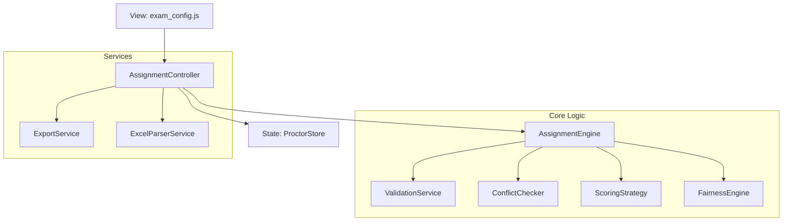

# ENTERPRISE SCHEDULING ARCHITECTURE (ESA) - PROCTOR SYSTEM

Chào bạn, với tư cách là một Senior Architect & Algorithm Engineer, tôi đã thiết kế lại toàn bộ hệ thống phân công của bạn theo mô hình **Clean Architecture**. Hệ thống được chia thành các lớp (Layers) và Module độc lập để đảm bảo tính mở rộng, dễ test và hiệu năng cực cao.

---

## 1. SƠ ĐỒ KIẾN TRÚC (ARCHITECTURE DIAGRAM)

---

## 2. CHI TIẾT CÁC MODULE

### A. ProctorStore (State Management)
- Quản lý trạng thái duy nhất (Single Source of Truth).
- Hỗ trợ Undo/Redo (nếu cần).
- Tự động lưu/tải từ LocalStorage/API.

### B. AssignmentEngine (Hybrid Heuristic)
- Sử dụng thuật toán **Hybrid Constraint Satisfaction (CSP)** kết hợp **Heuristic Scoring**.
- Quy trình: Lọc (Hard Constraints) -> Chấm điểm (Soft Constraints) -> Phân bổ (Load Balancing).

### C. ConstraintService (Hard Rules)
- `Rule 1`: Không trùng lịch thời gian thực.
- `Rule 2`: Né môn chuyên môn.
- `Rule 3`: Né lớp chủ nhiệm (nếu có dữ liệu).
- `Rule 4`: Giới hạn ca trực tối đa.

### D. ScoringService (Optimization Engine)
- Tính toán "Điểm phù hợp" dựa trên trọng số (Weights).
- `Weight 1`: Cân bằng số ca (Fairness).
- `Weight 2`: Ưu tiên cặp đôi Nam/Nữ (Diversity).
- `Weight 3`: Tránh phòng cũ (Familiarity).

### E. Validation & Report Service
- Kiểm tra tính đúng đắn của dữ liệu trước khi chạy.
- Xuất báo cáo Conflict chi tiết (Tại sao người này không được xếp vào phòng này?).

---

## 3. FLOW THUẬT TOÁN (CORE ALGORITHM)

1. **Preprocessing**: Chuẩn hóa dữ liệu (Normalize subjects, indexing proctors).
2. **Session Sorting**: Sắp xếp các ca thi theo độ ưu tiên (Ca khó xếp trước).
3. **Room Loop**:
   - Tìm tập ứng viên thỏa mãn Ràng buộc cứng (Hard Rules).
   - Chấm điểm cho từng ứng viên bằng Rule-based Scoring.
   - Chọn Top 2 ứng viên có điểm cao nhất.
   - Cập nhật Load của ứng viên vào Fairness Engine.
4. **Postprocessing**: Tự động sinh danh sách dự phòng từ những người rảnh.

---

## 4. PHÂN TÍCH ĐỘ PHỨC TẠP (COMPLEXITY ANALYSIS)

- **Thời gian (Time Complexity)**: $O(S \times R \times P)$
  - $S$: Số ca thi.
  - $R$: Số phòng mỗi ca.
  - $P$: Số giám thị.
- **Không gian (Space Complexity)**: $O(P + S \times R)$
  - Lưu trữ map trạng thái bận và kết quả phân công.
- **Tối ưu**: Sử dụng `Bitmask` hoặc `Set` để kiểm tra bận trong $O(1)$.

---

## 5. KẾ HOẠCH TRIỂN KHAI

Tôi sẽ tiến hành chia nhỏ mã nguồn thành các module chuyên biệt:
1. `proctor_store.js`: Quản lý dữ liệu.
2. `proctor_engine_core.js`: Thuật toán lõi.
3. `proctor_rules.js`: Tập hợp các quy tắc (Constraints).
4. `proctor_export.js`: Xử lý đầu ra.

Bạn có đồng ý với phương án tách file chuyên sâu này không? Việc này sẽ giúp code cực kỳ "sạch" và dễ bảo trì về lâu dài.
